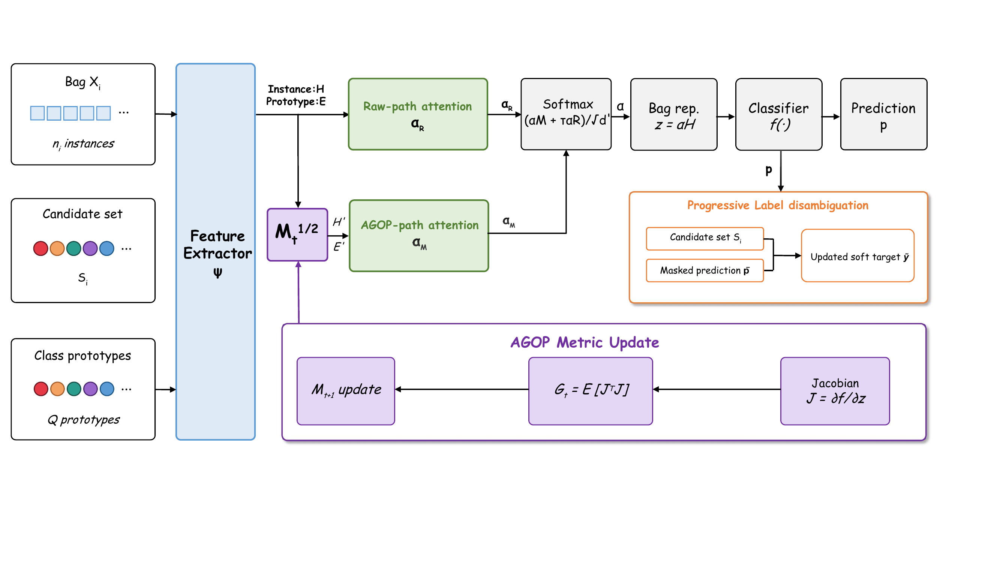

# Enhanced Multi-Instance Partial Label Learning via Average Gradient Outer Product

<p align="center">
  <a href="https://openreview.net/"></a>
  <a href="https://proceedings.mlr.press/"></a>
  
</p>

Official implementation of **"Enhanced Multi-Instance Partial Label Learning via Average Gradient Outer Product"** (ICML 2026).

**Nan Cao\*, Xu Zhao\*, Teng Zhang** &nbsp;(\*equal contribution)
Huazhong University of Science and Technology

> **TL;DR.** Under the dual weak supervision of multi-instance *and* partial-label learning, we use the Average Gradient Outer Product (AGOP) to reshape the feature metric *before* attention, so the model locates the true key instances instead of being misled by false-positive candidate labels.

## Abstract

Multi-instance partial-label learning (MIPL) annotates each training bag with a candidate label set containing one true label and several false positives. MIPL is strictly harder than the sum of multi-instance and partial-label learning: when both signals are weak, even the bag-level supervision is unreliable, making the association between key instances and the true label especially hard to recover. We propose **AGOPMIPL**, which uses the average gradient outer product to amplify discriminative feature directions and improve key-instance identification; feature prototypes and a progressive disambiguation strategy further suppress noisy candidates. A key advantage is that AGOP mitigates the weak supervision in both spaces with a single mechanism, rather than requiring separate modules. On four MIPL benchmarks and the real-world CRC-MIPL dataset, AGOPMIPL consistently outperforms five state-of-the-art baselines, with up to 25.9% relative gain on CRC-MIPL-KMeansSeg.

## Method

<p align="center">
  
</p>

AGOP is computed from the cross-bag Jacobian and used to transform instance/prototype features before a dual-path attention; a progressive label-disambiguation step then refines the soft target.

## Setup

```bash
conda create -n agopmipl python=3.10
conda activate agopmipl
pip install -r requirements.txt
```

Datasets: MNIST-MIPL, FMNIST-MIPL, Birdsong-MIPL, SIVAL-MIPL, and the real-world CRC-MIPL. <!-- TODO: 数据下载/放置说明 -->

## Run

```bash
# TODO: 训练/评测命令
python main.py --dataset FMNIST-MIPL --r 1
```

## Citation

```bibtex
@inproceedings{cao2026agopmipl,
  title     = {Enhanced Multi-Instance Partial Label Learning via Average Gradient Outer Product},
  author    = {Cao, Nan and Zhao, Xu and Zhang, Teng},
  booktitle = {Proceedings of the 43rd International Conference on Machine Learning},
  series    = {Proceedings of Machine Learning Research},
  volume    = {306},
  year      = {2026},
  publisher = {PMLR}
}
```

## Acknowledgement

This work builds on the Recursive Feature Machine / AGOP framework of Radhakrishnan et al. (*Science*, 2024).
